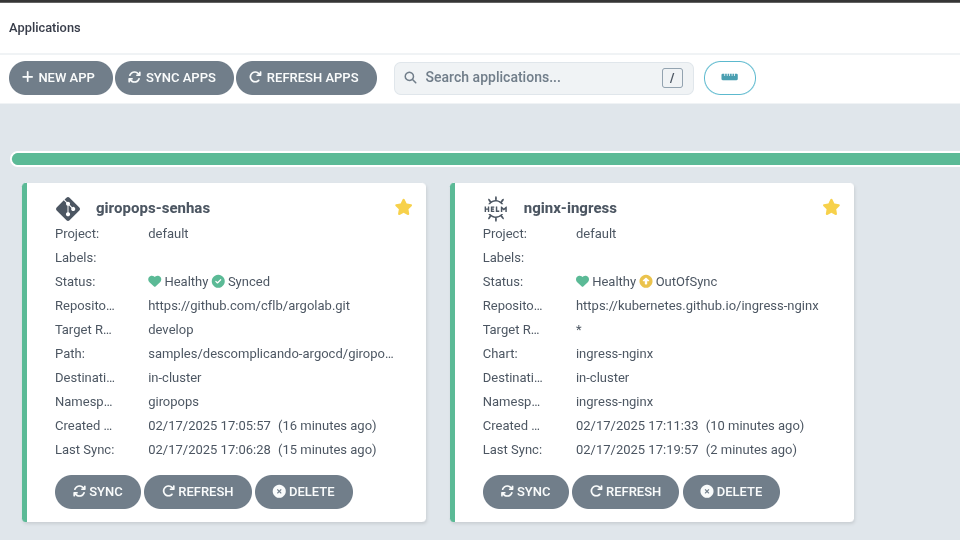

# Argocd Applications

Este repositório contem algumas aplicações que podem ser instaladas no kubernetes via argocd.

# Como Instalar?

A instalação é simples, basta executar ```kubectl apply -f <application-dir>/<application-manifest.yaml>```

## Applications

### Nginx-Ingress-Controller

```bash
kubectl apply -f nginx-ingress-controller/application.yaml
```

### Giropops-Senhas

```bash
kubectl apply -f giropops-senhas/giropops-senhas.yaml 
```

### Bitwarden

```bash
kubectl apply -f bitwarden/secret.yaml
kubectl apply -f bitwarden/pv.yaml
kubectl apply -f bitwarden/pvc.yaml
kubectl apply -f bitwarden/application-bitwarden.yaml 
```


